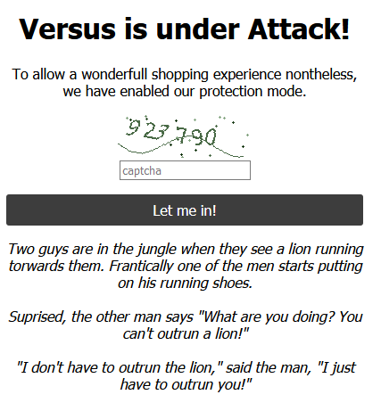
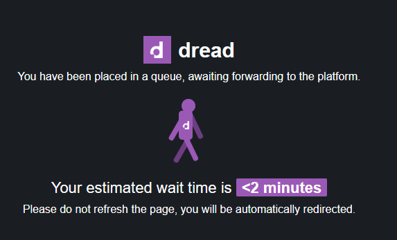
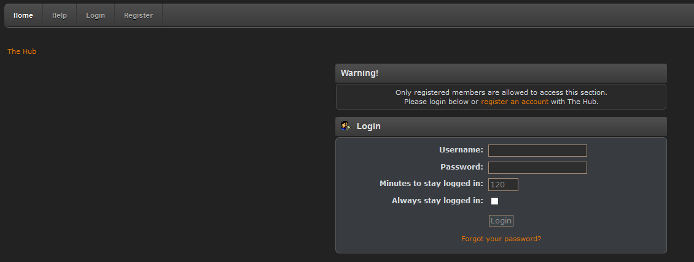

# This has been upgraded to Python3.9.5.

This is a tor crawler/scraper. Some artifacted code remains that loops through all tor sites one at a time, but then it was computed that even with multi-threading and a timeout at 1/10th of a second, this would take 2^80 divided by 12 (number of threads) divided by 10 (tenth of a second per timeout) seconds to complete. It is true that brute force is probably the only way to get to sites that don't no other sites link to, but the crawler works pretty well. I was able to find 34 new onion sites in 15 minutes.

This code runs on Windows, and has not yet been tested on any Linux flavors, but that's next. In order to run this, edit your \Tor Browser\Browser\TorBrowser\Data\torrc file and add at the bottom:

SocksPort 9050

and restart Tor. This allows Python to use Tor by proxy on port 9050. In linux, this path is \Browser\TorBrowser\Data\Tor.

## Changes to the Dark Web

There have been substantial improvements to the dark web since I ran this code some years back. First, even with headers, some sites manage to detect that the code is indeed a bot. Or, they just have a captcha for any and all traffic. Either way, the HTMLPages folder will contain HTML that looks like this:

Or even this, which I think is more clever (as if my code could wait and follow a redirection):

Second, you have to login to see anything, even clues to what might be the site contents. 

Third, users are encouraged to use PGP to confirm site identity, and their own identity too (I think). I'm pretty sure that if the FBI takes over a machine, the PGP check will still pass, so I'm not sure what this development buys anyone. 

Despite all of the above, such a crawler/scraper is required for any comprehensive approach to the dark web.
